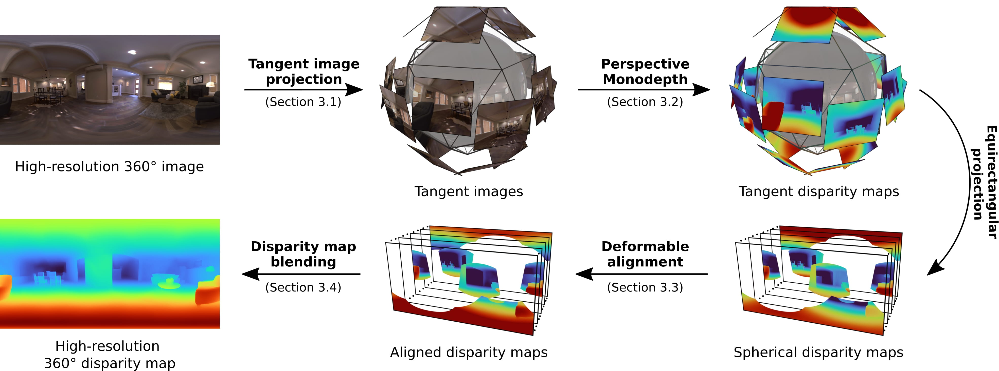
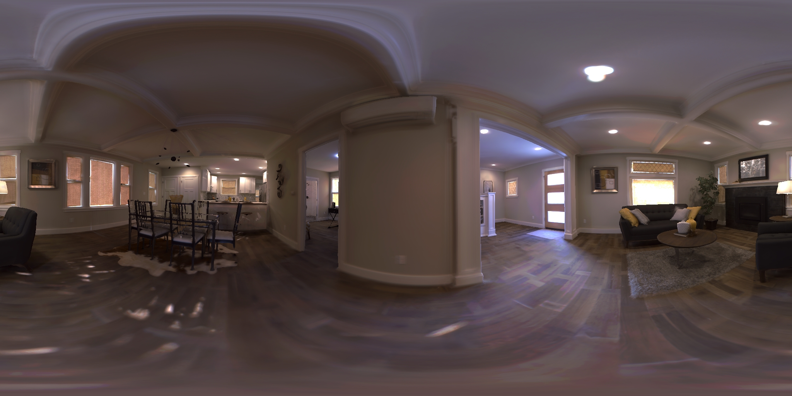
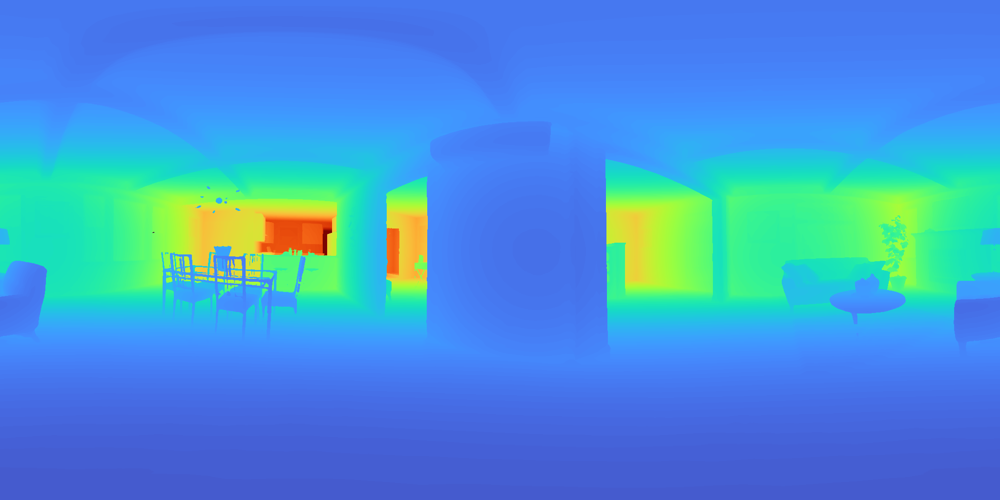
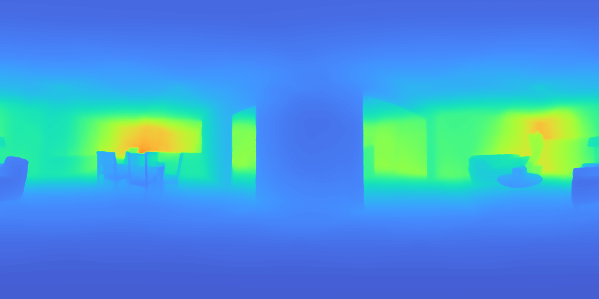
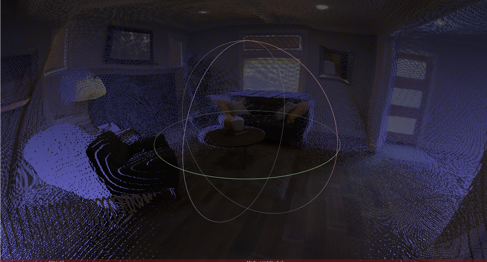
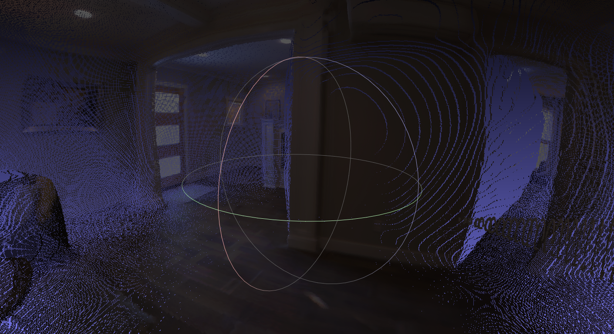
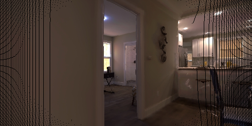
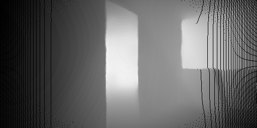

# PanoTo3D: Panorama to 3D Gaussian Splatting Pipeline

This repository implements an end-to-end pipeline to convert a single 360-degree panorama or point cloud into a 3D Gaussian Splatting scene suitable for rendering, novel view synthesis, and downstream applications like inverse rendering and scene editing through Gaussian manipulation.

GitHub: [https://github.com/Soham-Gaonkar/panoto3D](https://github.com/Soham-Gaonkar/panoto3D)

---

## Introduction

This project aims to reconstruct a scene in 3D directly from a monocular 360-degree panorama by:

* Estimating dense depth from the panorama
* Backprojecting to a point cloud
* Converting each point into a 3D Gaussian representation
* Synthesizing novel camera views for training
* Training a Gaussian Splatting model for high-fidelity radiance field rendering

The pipeline is modular and serves as a foundation for tasks such as:

* Inverse rendering from panoramas
* Interactive scene editing with Gaussian primitives
* Depth- and geometry-aware view generation from a single image

---

## Completed Stages

### 1. Monocular Depth Estimation from Panorama

* Uses MonoDepth360 to estimate depth from an equirectangular image.
* Result: `depth.png`, which is backprojected to a 3D point cloud.



<table>
    <tr>
        <td align="center"><b>RGB</b><br></td>
        <td align="center"><b>Ground Truth</b><br></td>
        <td align="center"><b>Predicted</b><br></td>
    </tr>
</table>

### 2. ERP to Pointcloud

* Converts equirectangular panorama and its depth map into a 3D point cloud (PLY format).
* Output: `scene/pointcloud.ply`
<table>
    <tr>
        <td align="center"><b>Point Cloud (View 1)</b><br></td>
        <td align="center"><b>Point Cloud (View 2)</b><br></td>
    </tr>
</table>

### 3. Pointcloud to Per-Point Gaussians

* Each point is converted into a Gaussian with diagonal covariance and RGB color.
* Script: `prep/cluster_gaussians.py`
* Output: `scene/gaussians_simple.json`

(Could be improved by using a more sophisticated clustering method for better Gaussian initialization.)

### 4. Conversion to 3DGS Format

* Decomposes covariance matrices into scale and quaternion rotation.
* Scripts:

  * `prep/export_gaussians.py`
  * `prep/convert_gaussians_format.py`
* Output: `scene/gaussians_3dgs_final.json`

### 5. Camera View Synthesis for Training

* Generates synthetic views and depths for training from the point cloud.
* Output Directory: `scene_init/`

  * `transforms_train.json`
  * `images/`
  * `depths/`
* Code: `pointcloud_to_scene_init.py`

<table>
    <tr>
        <td align="center"><b>View</b><br></td>
        <td align="center"><b>Depth</b><br></td>
    </tr>
</table>

> 🔧 **Planned**: Integration of diffusion-based inpainting (inspired by ExScene) during this stage to fill incomplete or sparse regions in synthesized views and depth maps. This will improve training data continuity and overall rendering quality.

### 6. Training with Gaussian Splatting

(Ongoing)
* Code: `3DGS/gaussian-splatting/train.py`

---

## Remaining Tasks and Issues

* Add accurate `camera_angle_x` to transforms based on image metadata or FOV.
* Normalize exposure or brightness across views.
* Filter Gaussians based on visibility or density.
* Evaluate and render final output using `render.py`.
* Create final documentation diagrams and setup instructions.

---

## Future Work

* **Diffusion-Based Inpainting**
  Plan to integrate diffusion models during scene rasterization (ExScene-inspired) to hallucinate missing geometry and textures in training views.
* **Better Gaussian Clustering**
  Replace naive clustering with geometry- and visibility-aware initialization.
* **Full Scene Graph Generation**
  Extend the pipeline to produce scene graphs for advanced editing and relighting.

---

## Gaussian Initialization Details

* No scaling is applied when converting PLY to JSON to maintain consistency with depth maps.
* SH (spherical harmonics) coefficients are initialized directly using PLY RGB values.
* Current initialization supports faster training convergence and better visual fidelity.

---

## Directory Structure

```
Exscene/
  scene/
    pointcloud.ply
    gaussians_simple.json
    gaussians_3dgs_final.json
  scene_init/
    images/
    depths/
    transforms_train.json
    transforms_test.json
    prep/
    cluster_gaussians.py
    export_gaussians.py
    convert_gaussians_format.py
360monodepth/

3DGS/
  gaussian-splatting/
    train.py

```

---

## References

* 3D Gaussian Splatting (SIGGRAPH 2023): [https://github.com/graphdeco-inria/gaussian-splatting](https://github.com/graphdeco-inria/gaussian-splatting)
* MonoDepth360: [https://github.com/manurare/360monodepth](https://github.com/manurare/360monodepth)
* Open3D: [http://www.open3d.org/](http://www.open3d.org/)
* ExScene: [https://arxiv.org/abs/2503.23881](https://arxiv.org/abs/2503.23881)
